# Cyber Guardian Grand Challenge

## Gaoyi

可以發現有兩階段的判斷，但是在第一階段的判斷是所有卡片的判斷結果總和>16才會通過，總是沒辦法進入第二階段

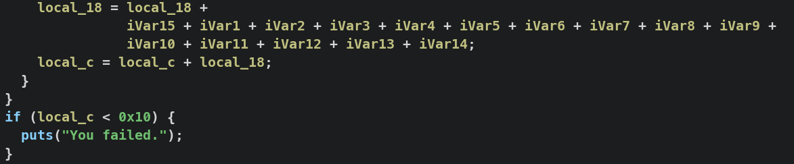

通過二階段檢查之後可以拿到flag

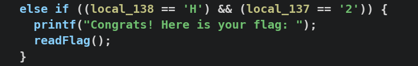

不管如何沒辦法從通過驗證的方法拿到flag，考慮模擬讀flag的函式

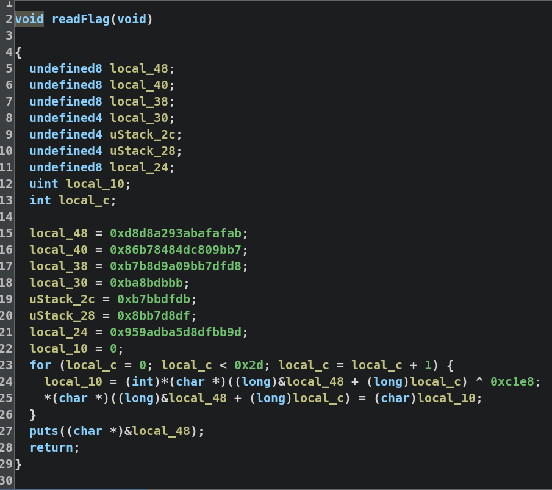

可以發現flag的資料寫死在這個函式裡面，其他的驗證過程也都沒有用到return值

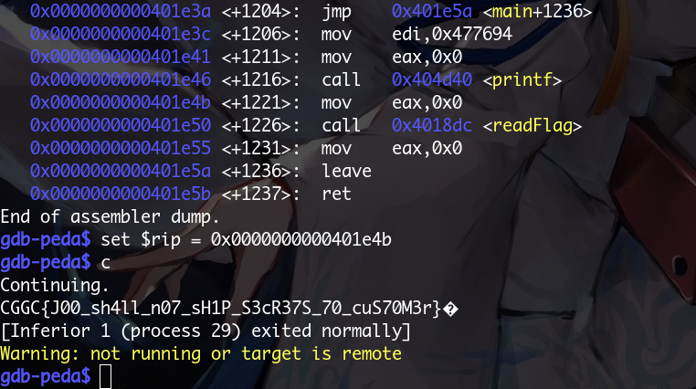

## Gift

程式不怎麼複雜，提供一次任意地址寫之後就觸發overflow

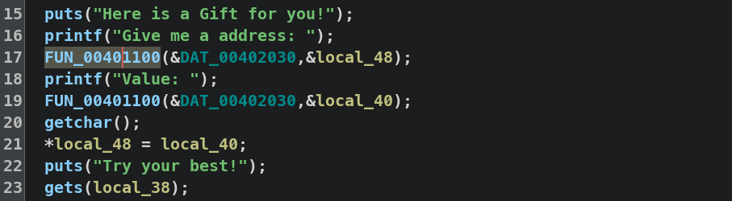

開啟了canary，不過可以看到沒有開RELRO，考慮劫持 `__stack_chk_fail`

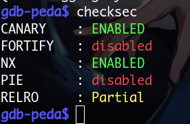

劫持完之後就可以無視canary

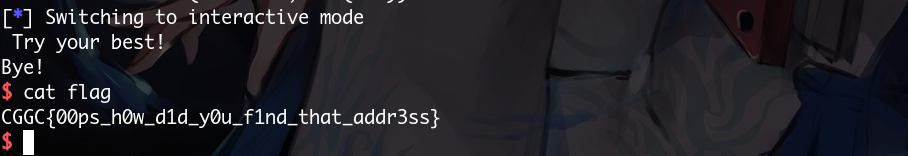

## Note

malloc選單題，保護全開

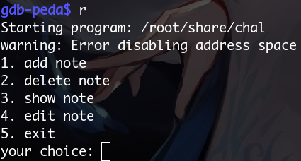

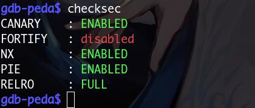

可以看到最多分配16個堆塊，也存放了size，沒辦法overflow

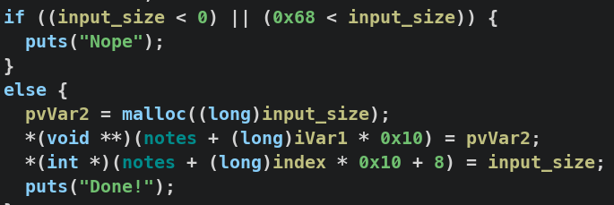

free完之後也對對應的notes清零，沒有uaf

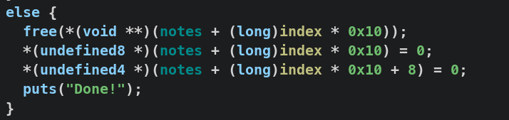

不過在 `edit_note` 中出現fixed size overflow，可以改到下一個堆塊的size

因此可以分配與帳面上大小不吻合的堆塊，造成overlap，並可以用overlap 去做 tcache poisoning

其中的難點在於leak libc，大小被限制在0x68 不過可以利用fixed overflow把size改到smallbin size

填滿smallbin size tcache之後free掉會觸發consolidate的檢查

不過如果讓smallbin下一塊chunk是連著top chunk似乎可以繞過這個錯誤

由於reverse into tcache所以不用再改一次size，可以看到成功free進去unsort bin

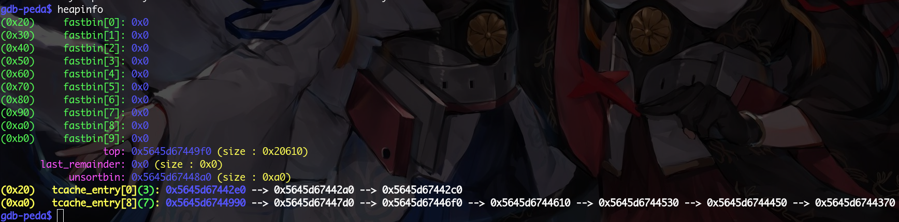

最後是利用 `__free_hook` 搭配 `system` ，隨便spray `/bin/sh` 進去就能拿到shell

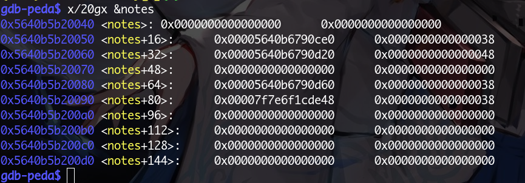

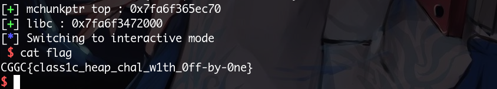
