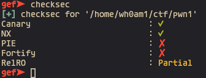
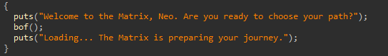
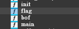
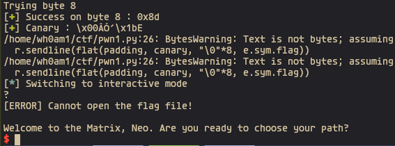
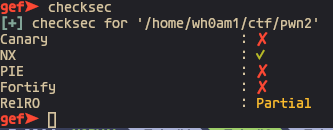
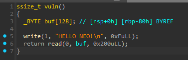
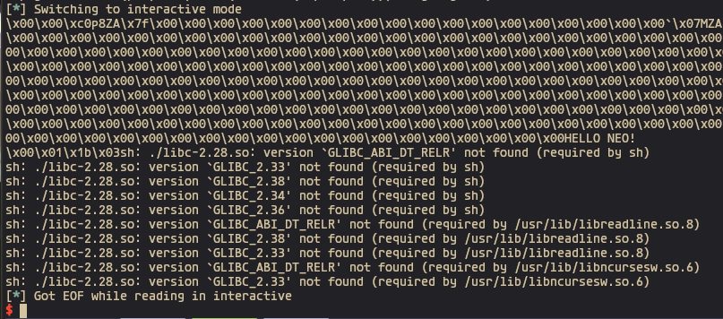

# HARUUL ZANGI CTF 2024

## Matrix : Code Canary

- Checksec

在 `bof()` 裡面可以看到明顯的長度不吻合, 導致 stack overflow, 但是有canary保護

不過可以利用 `fork()` child 跟 parent 的 canary 會相同的特性去逐位爆破, 失敗的話 child 不會印出第二行輸出, 因此很好判別

爆破成功之後可以執行後門直接拿 flag

賽中因為主辦方網路問題, 嘗試了很多次才爆破成功, 不過後來改用第二個 mirror 之後連線有比較穩定

## Matrix : Return to Zion

- Checksec

沒有開啟 canary 以及有很明顯的 stack overflow, 不過只能用 write 來打印地址

很快會發現沒有 gadget 來控第三個參數, 不過可以讓暫存器維持原樣就好, 只更改 fd 和 buf 之後直接呼叫 write(), 然後再擷取 6 bytes

在本地端因為 ld 版本不同, 進到 shell 的時候會崩潰, 不過遠端會成功

