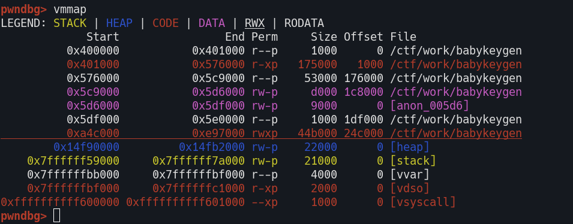

# CTF@CIT 2025 Writeup

## Reverse
### Read Only (solved)
Open the binary in IDA, and see the flag


### Ask Nicely (solved)
The password is hard-coded


### Serpent (solved)
The code is obfuscated with a bunch of `I` and `L` :


We can first rename the function in `main`, then we can trace the calls by renaming the functions globally, with vim command :

```
%s/<name>/<new-name>/g
```

After renaming 3 functions, we can see the output is the variable `lIIlllllIl`, inside `stage1`. Simply print it out


### Baby Keygen (solved)
The initial check validates :

1. If the length is 16
2. If the prefix is `KEY_`
3. If every bytes are numbers/alphabets


Then we can step in the `validate()`, but it seems like a packed payload, since there's a extra RXP region on the memory



I used the string `KEY_AAAABBBBCCCC`, and got the flag after stepping into `validate()`.


### Secure keygen (unsolved)
The program holds a account pool with a menu, but it keeps crashing. Maybe patches are needed.


## OSINT
### The Domain Always Resolves Twice (solved)
We can see a link to a website on the LinkedIn profile, dig the flag by using `whois`


## Web
### Breaking Authentication (solved)
There's SQLi on the login page, and we can verify by logging in with username `admin` and password `'or 1='1` :


But there's nothing after we login, so try find flag in the database, and this can be done by `sqlmap` :

```
sqlmap -u 'http://23.179.17.40:58001/' --form --smart -D app --dump
```

The flag is inside `secret` table :


### Mr. Chatbot (unsolved)
Thought it is a prompt injection challenge, but the app is actually implemented by JS :


