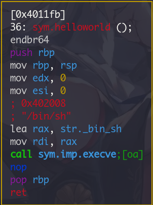
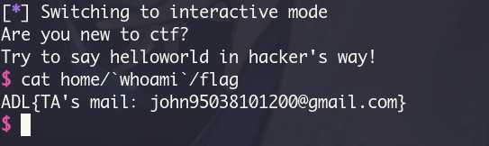
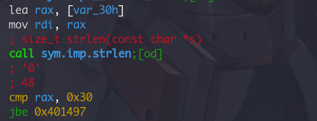
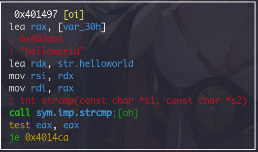
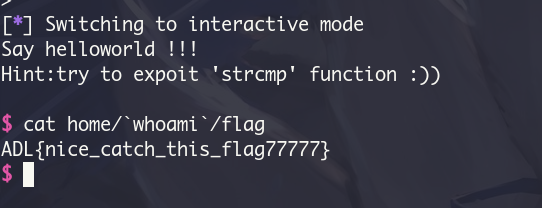
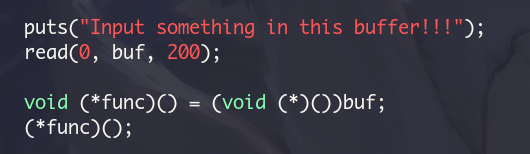
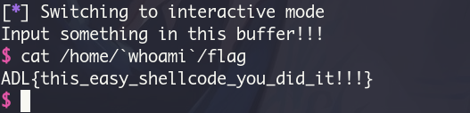

# ADL CTF
## helloworld

可以看到跳去`helloworld`之後就可以拿到shell, 而且程式有明顯的stack overflow

## helloworld2

跟上一題雷同，可是會先對輸入的長度以及內容做檢查

不過可以用NULL byte繞過，接下來是要平衡stack才不會在踩進`system()`的時候crash

## shellcode

直接執行了輸入的內容

剩下的2跟3是繞過一些對於shellcode的檢查，不過我沒有很熟asm

father利用的是child跟parant用相同的canary，不過總是爆破不出來
