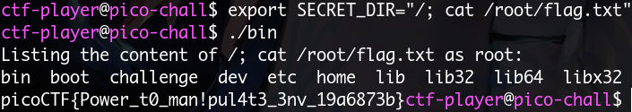

## Cache me outside
使用 [pwninit](https://github.com/io12/pwninit) 修復rpath

更改tcache entry 指向flag所在的idx

## Unsubscriptions Are Free

從這裡可以找到 dangling pointer

驗證

實際chunk大小為`0x20`, 因此可以覆寫已經`free()`掉的`whatToDo`

## filtered-shellcode

程式會對傳入的資料做一些操作然後當作函式指針執行

由於透過這個filter只能使用兩byte一組的shellcode, 因此逐個byte放入 `/bin//sh` 。此外在32位元下 `syscall` 要替換成 `int 0x80`

## babygame02

跟前面一樣有 `l` 這個選項可以更改玩家頭像，可以用這個特點覆寫return address的最低位

不過在remote上連線不是很穩定，多送幾次之後就能跳去win了

## tic-tac

構造另外一個空檔案跟flag symlinc去同個地方產生race condition，不過我用shell怎麼都沒辦法成功，後來用了c的讀檔就跑出來了

## VNE

試了一下發現需要某個環境變數上指定的路徑，沒逆向binary本身但想試試看command injection : 

結果就讀出來了

## Guessing game 1

file下去可以發現是靜態編譯，並且local測試多次之後會發現key是固定的

直接用ROPGadget製造ropchain

##  Kit Engine

題目給了會把東西餵給d8 shell的界面，在source裡面可以看出已經列出了patch的比較:

可以看到這個function:

 

需要通過以下檢驗：

 

最後直接當成函式指針呼叫：

由於只能看stdout回顯，沒辦法直接互動，所以用 `shellcraft.cat`

 
